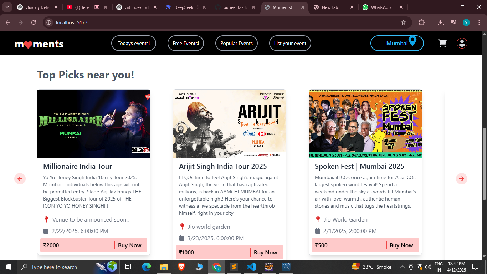
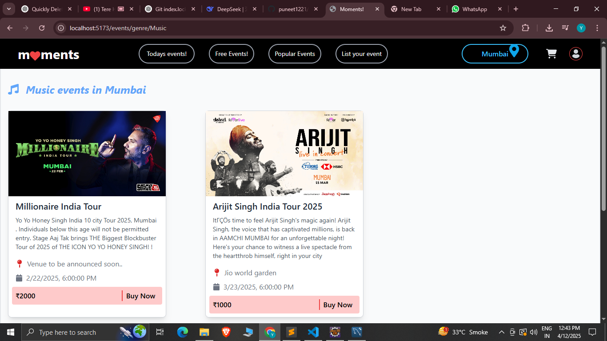

# Extensions Used

- **react-extensions**
- **react-fa-icons**
- **tailwind css**
- **react-router-dom**
- **react-axios**

---

# PayPal Sandbox Credentials

- **Email:** [your-email@example.com]  
- **Password:** [your-password]

---

# Database Information

### General Info
- **Application Name:** moments_app
- **Database Name:** moments_db
- **Driver Class Name:** com.mysql.cj.jdbc.Driver

### Configuration
```properties
spring.datasource.username=root
spring.datasource.password=root     --or no password
spring.datasource.url=jdbc:mysql://localhost:3306/moments_db
spring.jpa.hibernate.ddl-auto=update
spring.jpa.show-sql=true
logging.level.root=warn
```

# Setting Up Config for Starter-Mail
```properties
spring.mail.host=smtp.gmail.com
spring.mail.port=587
spring.mail.username=[your own mail for issuing tickets to user]
spring.mail.password=[app password for mail]
spring.mail.properties.mail.smtp.auth=true
spring.mail.properties.mail.smtp.starttls.enable=true
```

# Payment Services
```properties
paypal.client.id= **************  your paypal client id*********
paypal.client.secret=paypal_sandbox_password
paypal.mode=sandbox
```

#I have used imgur cloud to store the images which is free you can add your credentials . I am storing the metadata in database 
# Images (Imgur)
```properties
imgur.client-id=imgur_client_id
imgur.client-secret=imgur_client_secret
```

---

# How to Make API Calls in Java

## Understand the HTTP Request Components:
- **URL:** The endpoint where the API is hosted.
- **Method:** HTTP method (GET, POST, PUT, DELETE, etc.).
- **Headers:** Key-value pairs like Authorization, Content-Type, etc.
- **Body (Optional):** The payload for POST or PUT requests, often in JSON format.

## Using RestTemplate (Spring Framework)

### 1. Make a GET Request
Use `RestTemplate.getForObject` or `RestTemplate.exchange` to fetch data.

```java
RestTemplate restTemplate = new RestTemplate();
String url = "https://api.example.com/data";

// Make a GET request and get the response as a String
String response = restTemplate.getForObject(url, String.class);

System.out.println("Response: " + response);
```

### 2. Make a POST Request
Use `RestTemplate.postForEntity` or `RestTemplate.exchange` for POST.

```java
RestTemplate restTemplate = new RestTemplate();
String url = "https://api.example.com/data";

// Create request body
Map<String, String> requestBody = new HashMap<>();
requestBody.put("key1", "value1");
requestBody.put("key2", "value2");

// Send POST request with headers
HttpHeaders headers = new HttpHeaders();
headers.set("Content-Type", "application/json");

HttpEntity<Map<String, String>> requestEntity = new HttpEntity<>(requestBody, headers);

ResponseEntity<String> response = restTemplate.postForEntity(url, requestEntity, String.class);

System.out.println("Response: " + response.getBody());
```

### 3. Make a Request with Custom Headers
Use `HttpHeaders` to pass headers like Authorization.

```java
HttpHeaders headers = new HttpHeaders();
headers.set("Authorization", "Bearer <your-token>");
headers.set("Content-Type", "application/json");

// Attach headers to the request
HttpEntity<String> entity = new HttpEntity<>(headers);
ResponseEntity<String> response = restTemplate.exchange(
    "https://api.example.com/data",
    HttpMethod.GET,
    entity,
    String.class
);

System.out.println("Response: " + response.getBody());
```

### 4. Error Handling
Wrap the API call in a try-catch block to handle exceptions like `HttpClientErrorException`.

```java
try {
    ResponseEntity<String> response = restTemplate.getForEntity("https://api.example.com/data", String.class);
    System.out.println("Response: " + response.getBody());
} catch (HttpClientErrorException e) {
    System.err.println("Error: " + e.getStatusCode() + " - " + e.getResponseBodyAsString());
}
```

## Using HttpClient (Modern Java - Post Java 11)
If you're using Java 11 or later, the built-in `HttpClient` is a lightweight and modern alternative.

### 1. GET Request

```java
HttpClient client = HttpClient.newHttpClient();
HttpRequest request = HttpRequest.newBuilder()
    .uri(URI.create("https://api.example.com/data"))
    .GET()
    .build();

HttpResponse<String> response = client.send(request, HttpResponse.BodyHandlers.ofString());
System.out.println("Response: " + response.body());
```

### 2. POST Request

```java
HttpClient client = HttpClient.newHttpClient();
String json = "{\"key1\":\"value1\", \"key2\":\"value2\"}";

HttpRequest request = HttpRequest.newBuilder()
    .uri(URI.create("https://api.example.com/data"))
    .header("Content-Type", "application/json")
    .POST(HttpRequest.BodyPublishers.ofString(json))
    .build();

HttpResponse<String> response = client.send(request, HttpResponse.BodyHandlers.ofString());
System.out.println("Response: " + response.body());
```

## Summary: When to Use What
- Use `RestTemplate` if you're working with Spring Boot. It's simple and widely used.
- Use `HttpClient` for lightweight and modern Java projects (Java 11+).
- Use libraries like Retrofit or Feign for advanced cases requiring declarative HTTP clients.

## Common Tips
- **Debugging:** Use tools like Postman or curl to test the API before integrating it into your Java app.
- **JSON Parsing:** Use libraries like Jackson or Gson to convert JSON responses to Java objects.
- **Timeouts:** Always set timeouts for your HTTP client to avoid hanging requests.

---

# Handling Multipart FormData (Multiple Files + Text) Through REST

## Summary Notes: Creating an Event with File Uploads

### Overview
The process involves building an API endpoint to handle event creation, including uploading images (banner and gallery) and capturing event details. The frontend interacts with this endpoint using Axios.

### Backend Implementation

1. **Entity Class (Event):**
   - Contains all event-related fields such as `name`, `dateTime`, `ticketCost`, `availableTickets`, `bannerUrl`, and more.
   - Uses `@ElementCollection` for lists like `gallery`, `whatToExpect`, and `languages`.
   - Includes an embedded `Address` object with fields like `city`, `pincode`, `venue`, and `landMark`.

2. **DTO Class (AddEventDTO):**
   - Mirrors the fields of the `Event` entity.
   - Includes `MultipartFile` for `banner` and a list of `MultipartFile` for `gallery`.

3. **Controller (AdminController):**
   - Defines an endpoint `/admin/add-event` to handle event creation.
   - Uses the `@ModelAttribute` annotation to bind `AddEventDTO` from `multipart/form-data` requests.

4. **Service (ImgurService):**
   - Handles image uploads to Imgur.
   - Provides methods to upload a single image and multiple images.

5. **Implementation Flow:**
   - Convert `AddEventDTO` to an `Event` object.
   - Upload the banner and gallery images to Imgur.
   - Save the image URLs in the `Event` object.
   - Persist the event using `eventRepo.save(event)`.

6. **Exception Handling:**
   - Log errors during image upload or validation.
   - Return meaningful error responses to the client.

### Frontend Implementation

1. **Data Structure:**
   - Maintain event-related fields in `eventDetails`.
   - Separate arrays for `whatToExpect`, `termsAndConditions`, `languages`, etc.
   - Store `banner` and `gallery` as files.

2. **Form Submission:**
   - Use a `FormData` object to send data as `multipart/form-data`.
   - Append all event details, including files, into `FormData`.

   Example:

   ```javascript
   const formData = new FormData();

   Object.entries(eventDetails).forEach(([key, value]) => {
     if (value !== undefined) formData.append(key, value);
   });

   formData.append("banner", banner);
   gallery.forEach(file => formData.append("gallery", file));
   ```

3. **API Call:**
   - Use Axios to send the `FormData` to the backend.
   - Example:
     ```javascript
     axios.post('http://localhost:8080/admin/add-event', formData, {
       headers: { 'Content-Type': 'multipart/form-data' },
     })
     .then(response => console.log(response.data))
     .catch(error => console.error(error));
     ```

4. **Error Handling:**
   - Log errors from the API for debugging.
   - Display appropriate feedback to users if the submission fails.

### Key Challenges and Solutions

1. **Multipart Data Handling:**
   - Use `@ModelAttribute` in Spring Boot to map `multipart/form-data` requests.

2. **Image Uploads:**
   - Delegate image uploads to a service (ImgurService).
   - Handle exceptions during file uploads and ensure robust error reporting.

3. **Field Mapping Issues:**
   - Ensure frontend keys match DTO field names exactly.
   - Debug using logs to verify data received by the backend.

4. **Address Fields Null:**
   - Confirm `FormData` appends address fields correctly.
   - Log the DTO in the backend to inspect received data.

### Why FormData Over JSON for File Uploads?

#### File Handling Limitation in JSON:
- JSON is purely text-based and does not support binary data (e.g., image files) directly.
- Encoding binary files into Base64 for JSON increases payload size significantly and impacts performance.

#### FormData for multipart/form-data:
- The `FormData` object is designed to handle both textual and file data seamlessly.
- It allows sending files (like images) along with other form fields in a single HTTP request.

#### Backend Support for FormData:
- Spring Boot supports `multipart/form-data` via the `@ModelAttribute` and `MultipartFile` classes.
- Files can be uploaded directly, and other fields are mapped simultaneously, avoiding the need for separate API calls.

#### Performance Benefits:
- Using `FormData` avoids the overhead of encoding/decoding binary data.
- Reduces payload size, improving the speed and efficiency of API calls.

#### Implementation Adjustments:

**Frontend:** Use `FormData` to construct the request with both files and event details.

**Backend:**
- Accept `multipart/form-data` using the `@ModelAttribute` annotation.
- Map `MultipartFile` fields in the DTO for seamless file handling.

#### Why Not JSON with Base64?
- Increased complexity in encoding/decoding files.
- Larger payload size due to Base64 encoding (approximately 33% size increase).
- Inefficient handling of large files and higher memory usage.

---

# Payment Transaction Rough Flow

Imagine This Scenario:
You are organizing a movie ticket booking system. Here's how it works:

1. **Customer requests a ticket** (just like the user creates a payment).
2. **You ask them to confirm the booking at the counter** (just like they go to PayPal’s site).
3. **If they pay successfully, you confirm and save the booking details** (just like saving payment info in the database).
4. **If they change their mind, you send them back with no ticket** (just like canceling the payment).

## Now Map This to Your Code:

### 1. /payment/create - Starting the Payment
This is like when a customer requests a ticket.

**What happens in your code?**
- User asks your backend, "I want to make a payment for $20."
- They send details like:
  - Amount: $20
  - Currency: USD
  - Payment Method: PayPal
- Your backend forwards this request to PayPal.
- PayPal creates the payment request and gives back a link (just like a counter person giving a ticket and asking, “Go to this counter to pay!”).
- Your backend sends this link to the frontend. The frontend then redirects the user to PayPal’s site to approve the payment.

### 2. /user/payment/success - Payment is Successful
This is like when the customer comes back after paying at the counter.

- The user approves the payment on PayPal’s site.
- PayPal redirects the user back to your site and sends:
  - Payment ID: A unique identifier for this payment.
  - Payer ID: The ID of the person who paid.
- Your backend takes these IDs and asks PayPal, “Hey, was the payment successful?”
- If PayPal confirms the payment was successful, your backend:
  - Saves the payment details in the database.
  - Redirects the user to the success page on the frontend.

### 3. /user/payment/cancel - Payment is Canceled
This is like when the customer changes their mind and doesn’t want the ticket anymore.

- The user cancels the payment on PayPal’s site.
- PayPal redirects the user back to your site to say, “They didn’t complete the payment.”
- Your backend redirects the user to the cancel page on the frontend.

## Visual Representation:
Here’s how it flows step by step:

1. **Create Payment:**
   - User → Backend → PayPal → Backend → User gets PayPal link.
2. **User Pays:**
   - User goes to PayPal → Pays → Redirected to /user/payment/success.
3. **Confirm Payment:**
   - Backend → Asks PayPal if payment is okay → If yes, save in DB and redirect to success page.
4. **Cancel Payment:**
   - User → Cancels on PayPal → Redirected to /user/payment/cancel.


Here Are ScreenShots:





